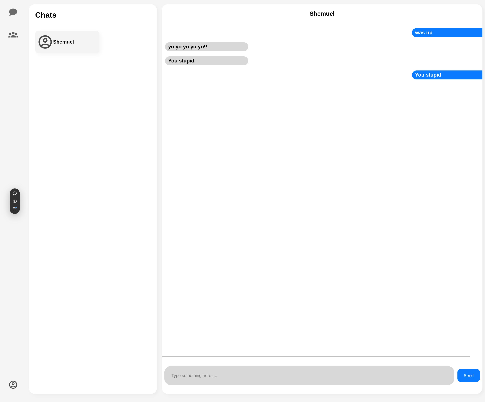

# Messenger app

<!-- logo -->
<div align="center">
  
  <p>Simple messaging app!</p>
</div>


https://messaging-app-seven-gilt.vercel.app/
## About
<div align="center">
  
</div>

### description
This is a simple messaging app that allows you to message people one on one and edit your profile information.
It's not very comlpicated or fancy but, it was alot of fun to make!


### built with
These are tools that I used to build the site

<ul>
  <li>
    <a href="https://react.dev/">React</a>
  </li>
  <li>
    <a href="https://nodejs.org/en">Node.js</a>
  </li>
  <li>
    <a href="https://expressjs.com/">Express</a>
  </li>
  <li>
    <a href="https://www.postgresql.org/">Postgresql</a>
  </li>
  <li>
    <a href="https://www.prisma.io/">Prisma</a>
  </li>
  <li>
    <a href="https://www.passportjs.org/">Passport</a>
  </li>
</ul>


## Local setup

```sh
cd frontend
npm run dev
```

